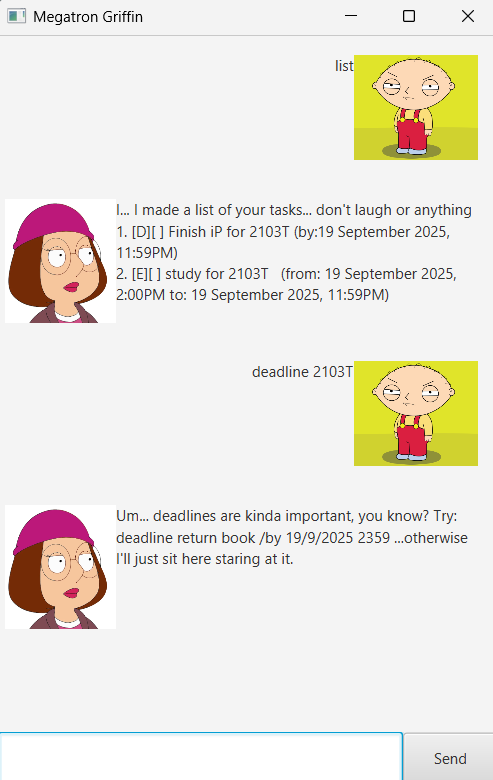

## MegaTron Griffin ToDo Bot



MegaTron Griffin ToDo Bot is a command-line application that helps you manage your tasks.  
Megatron Griffin is a chatbot inspired by Meg Griffin from the show "Family Guy". Megatron Griffin is designed to help you stay up-to-date with tasks, while having a sarcastic and insecure tone.
You can store tasks categorized into **todos**, **deadlines**, and **events**, and perform actions such as add, mark, unmark, delete, find, and list.

---

## Getting Started

1. Ensure you have **Java 17 or above** installed on your computer.
    - [Download Java here](https://www.oracle.com/java/technologies/javase/jdk17-archive-downloads.html)

2. Download the latest release JAR file from this repository’s [Releases](https://github.com/yourusername/yourrepo/releases).

3. Copy the JAR file into the folder you want to use as the home folder for the bot.

4. In the same folder, create a file named `data.txt` (this will store your tasks).

5. Open a terminal in that folder and run:

   ```bash
   java -jar megatrongriffin.jar
   ```

6. A console window will open, and you can start typing commands.

---

## Features

All commands should be typed in **lowercase**.

### 1. List all tasks
Displays all tasks currently stored.

```
list
```

---

### 2. Add a todo
Adds a simple todo task to memory.

```
todo DESCRIPTION
```

Example:

```
todo read a book
```

---

### 3. Add a deadline
Adds a task with a due date.

```
deadline DESCRIPTION /by DATE
```

- Format for DATE: `d/M/yyyy HHmm`
- Example:

```
deadline submit report /by 19/9/2025 2359
```

---

### 4. Add an event
Adds a task that starts and ends within a time range.

```
event DESCRIPTION /from START_TIME /to END_TIME
```

- Format for time: `d/M/yyyy HHmm`
- Example:

```
event team meeting /from 20/9/2025 1400 /to 20/9/2025 1600
```

---

### 5. Delete a task
Removes a task by its list number.

```
delete LINENUMBER
```

Example:

```
delete 2
```

---

### 6. Mark a task
Marks a task as complete.

```
mark LINENUMBER
```

Example:

```
mark 1
```

---

### 7. Unmark a task
Marks a task as **not complete**.

```
unmark LINENUMBER
```

Example:

```
unmark 1
```

---

### 8. Find a task
Searches for tasks containing a keyword.

```
find KEYWORD
```

Example:

```
find book
```

---

### 9. Exit
Exits the program.

```
bye
```

---

## Example Session

```
todo buy groceries
Yeah, whatever... it's on the list now.

list
I... I made a list of your tasks... don't laugh or anything
1. [T][ ] buy groceries

mark 1
Uh... okay... I marked it as done... I guess.
1. [T][X] buy groceries

bye
```

---

## Notes
- Tasks are automatically saved to `data.txt` in your working directory.
- Dates must follow the format `d/M/yyyy HHmm`.
- If you type an invalid command, the bot will respond with an error message.
